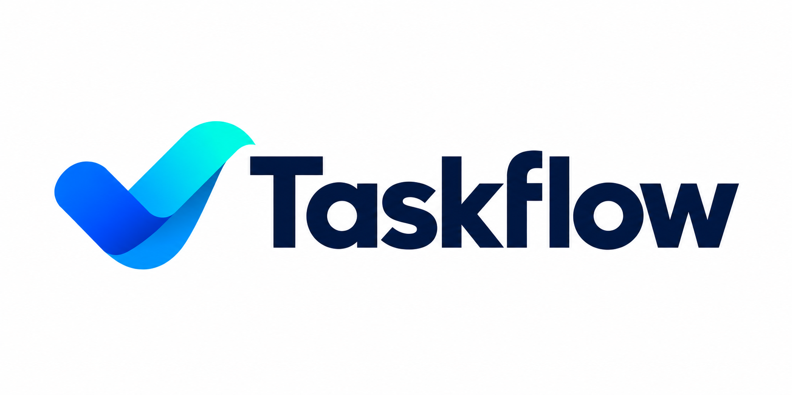

**\# Taskflow**

Taskflow — веб-приложение для управления задачами команды. Оно позволит создавать задачи, назначать ответственных, устанавливать сроки и отслеживать выполнение. Проект разрабатывается на Python с использованием FastAPI.

**\## Команда**

\- Чувильчиков Кирилл — Backend Developer

\- Судец-Ребров Арсений — Tech Lead, DevOps

\- БСМО-12-25

**\## Стек технологий**

\- Python 3.11

\- FastAPI

\- PostgreSQL

\- Docker

\- GitHub Actions

**\## Статус**

Проект в разработке.

**\## Установка и запуск**

(Будет добавлено позже)

**\## Лицензия**

MIT

